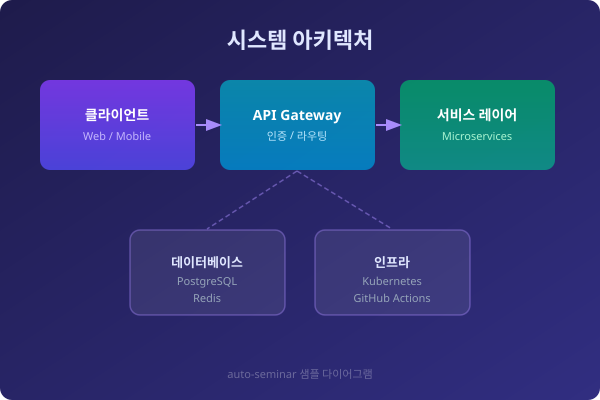

# 이미지 삽입 데모
## `slides/assets/` 활용 가이드

---

## 1. 인라인 이미지

슬라이드 내에 이미지를 일반 콘텐츠로 배치합니다.

> `slides/assets/` 폴더에 이미지를 넣으면 빌드 시 자동 복사됩니다.

---

## 2. 전체 배경 이미지

`` — 슬라이드 전체를 이미지로 채웁니다.

이 슬라이드의 배경은 `sample-bg.svg`입니다.

텍스트는 배경 위에 겹쳐서 표시됩니다.

---

## 3. 어두운 배경 + 밝기 조절

`` — 배경을 어둡게 만들어 텍스트를 읽기 쉽게 합니다.

### 밝기 조절로 가독성 확보

- `brightness:.3` → 매우 어둡게
- `brightness:.6` → 보통
- `brightness:1.2` → 밝게

---

## 4. 배경 분할 — 왼쪽 이미지

`` — 화면을 분할해 왼쪽에 이미지, 오른쪽에 텍스트를 배치합니다.

### 핵심 구성요소

- **클라이언트** — Web / Mobile
- **API Gateway** — 인증 및 라우팅
- **서비스 레이어** — Microservices
- **데이터베이스** — PostgreSQL + Redis

---

## 5. 배경 분할 — 오른쪽 이미지

`` — 오른쪽에 이미지, 왼쪽에 텍스트를 배치합니다.

### 이미지 분할 옵션 요약

| 문법 | 설명 |
|------|------|
| `![bg left:40%]` | 왼쪽 40% 이미지 |
| `![bg right:40%]` | 오른쪽 40% 이미지 |
| `![bg left]` | 왼쪽 50% (기본) |
| `![bg right]` | 오른쪽 50% (기본) |

---

## 6. 이미지 크기 조절

인라인 이미지는 `width`, `height` 속성으로 크기를 조절합니다.

| 문법 | 결과 |
|------|------|
| `` | 픽셀 단위 너비 |
| `` | 픽셀 단위 높이 |
| `` | 슬라이드 너비의 50% |

---

## 7. 이미지 도우미 버튼 사용법

슬라이드 뷰어에서 🎨 버튼 → **🖼 이미지 삽입** 섹션

1. 원하는 슬라이드로 이동 (키보드 ← →)
2. **인라인 / 배경 / 분할** 버튼 클릭
3. MD 소스 에디터가 자동으로 열리며 **현재 슬라이드 끝**에 문법 삽입
4. 파일명(`image.jpg` 등)을 실제 파일명으로 수정
5. 💾 **.md 다운로드** → `slides/` 폴더에 덮어쓰기 → push

> 에디터가 이미 열려 있으면 **커서 위치**에 삽입됩니다.
