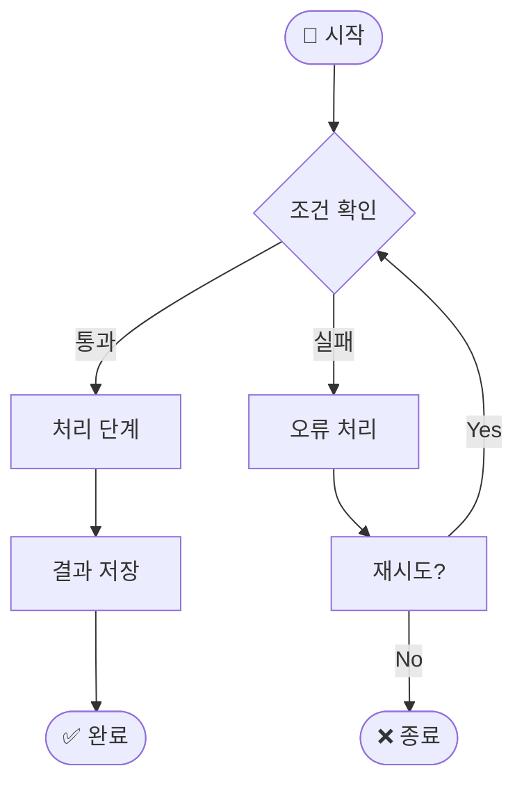
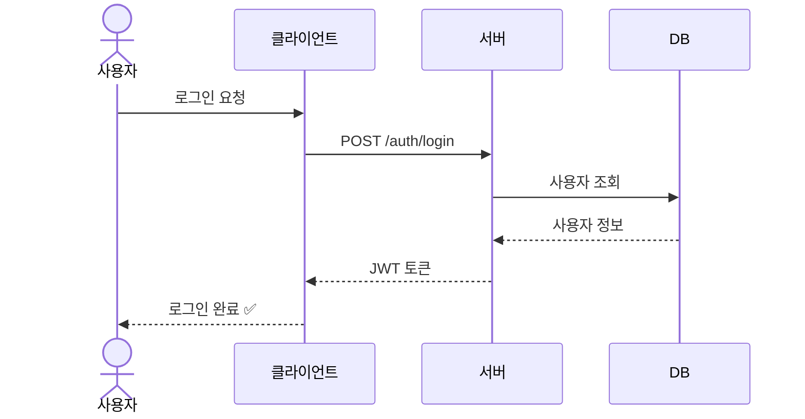
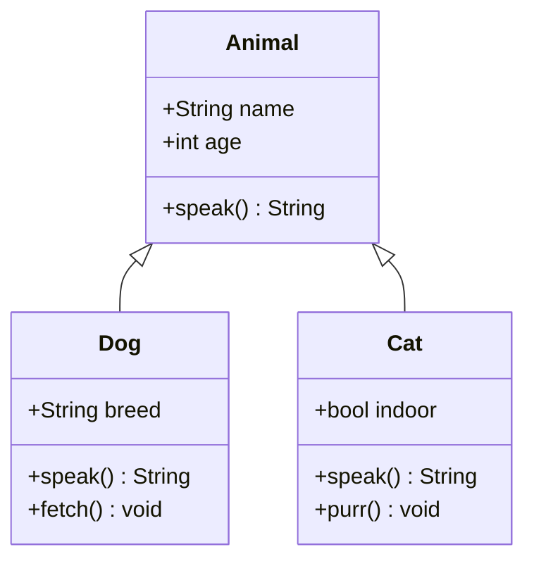
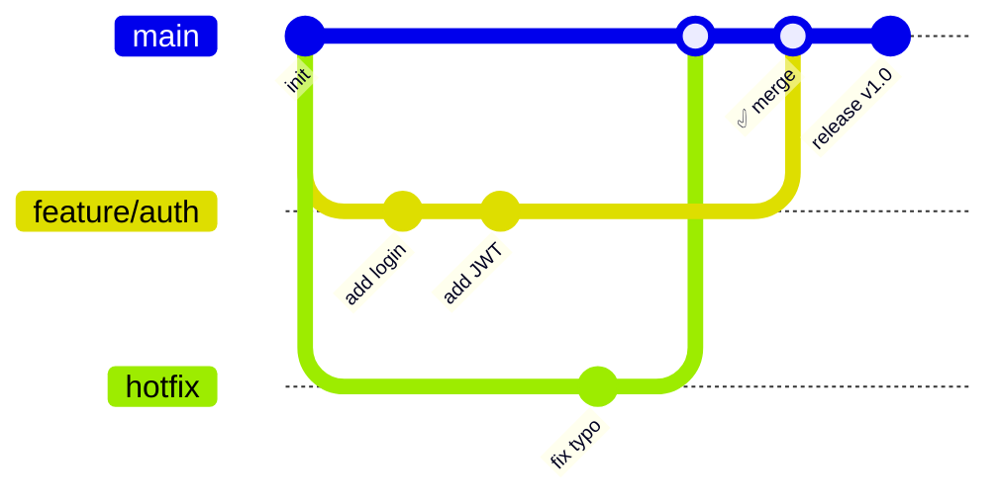
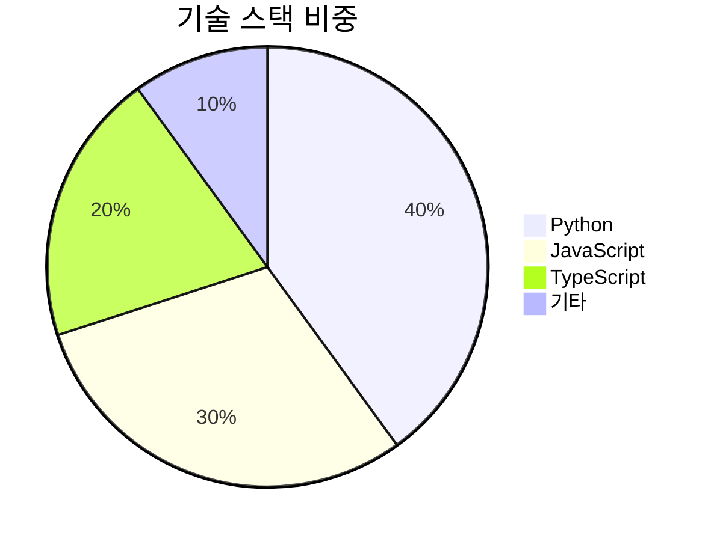
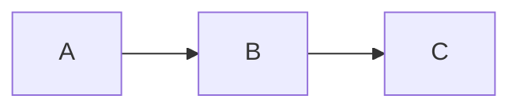
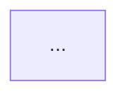

# Mermaid 다이어그램 데모

> `\`\`\`mermaid` 코드 블록만 작성하면 HTML 발표 뷰에서 자동 렌더링됩니다

## flowchart — 흐름도

<style scoped>
.mermaid { transform: scale(0.75); transform-origin: top center; }
</style>



## sequenceDiagram — 시퀀스

<style scoped>
.mermaid svg { max-height: 420px !important; }
</style>



## classDiagram — 클래스



## gitGraph — Git 브랜치



## pie — 파이 차트



## 사용 방법 & 제한

<style scoped>
section { font-size: 24px; }
pre { font-size: 0.78em; line-height: 1.32; }
table { font-size: 0.8em; }
</style>

**기본 사용법**

````markdown

````

**지원 범위**

| 항목 | 지원 여부 |
|------|----------|
| HTML 발표 뷰 | ✅ 실시간 렌더링 |
| 테마 전환 연동 | ✅ 자동 재렌더 |
| PDF / PPTX 내보내기 | ❌ 미지원 |
| 오프라인 환경 | ❌ CDN 필요 (`cdn.jsdelivr.net`) |

> PDF가 필요하면 브라우저 **Ctrl+P** 인쇄를 사용하세요.

## 큰 다이어그램 조절

<style scoped>
section { font-size: 26px; }
pre { font-size: 0.78em; line-height: 1.34; }
</style>

**다이어그램이 너무 크면** — `<style scoped>` 로 해당 슬라이드만 조절

````markdown
## 내 슬라이드

<style scoped>
/* 방법 1: 비율로 축소 (텍스트도 함께 작아짐) */
.mermaid { transform: scale(0.75); transform-origin: top center; }

/* 방법 2: 높이 제한 (가로로 긴 다이어그램) */
.mermaid svg { max-height: 420px !important; }
</style>


````
